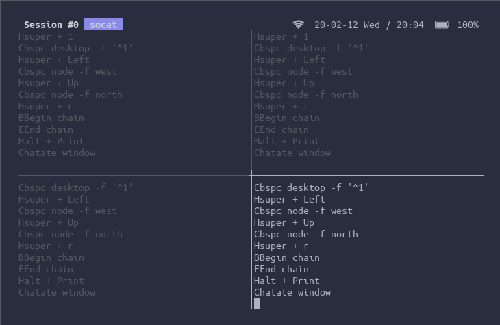

# sxhkd-statusd



The daemon redirects [sxhkd](https://github.com/baskerville/sxhkd) status
from named pipe to unix domain socket for accessing from multiple clients.

## How to install
- Just make and make install. for default, the binary placed at `/usr/local/bin`.
```bash
git clone https://github.com/piutranq/sxhkd-statusd
cd ./sxhkd-statusd
make
sudo make install
```

- When uninstall it, use `make uninstall`

## Usage
```
sxhkd-statusd [options] [source]
```

### source
The sxhkd status pipe to read.

Make sure the sxhkd-statusd is the only process is reading the pipe.

The clients can access sxhkd-statusd by connect to `[source].sxhkd-statusd`

### options

- `--help|-h`: Show the help message and exit.
- `--log|-l`: Set log level as following argument. The default value is `info`
    - `error`: Log only the error messages.
    - `info`: Log the error messages and some additional information, such as open/closing file descriptor
    - `verbose`: Log more information, such as sxhkd event
    - `silent`: Do not log any messages, including the error messages.

### example
```bash
# Launch the daemon
sxhkd-statusd -l error /run/user/$UID/sxhkd.fifo

# Connect to the daemon from a client process
socat UNIX_CONNECT:/run/user/$UID/sxhkd.fifo.sxhkd-statusd -
```
